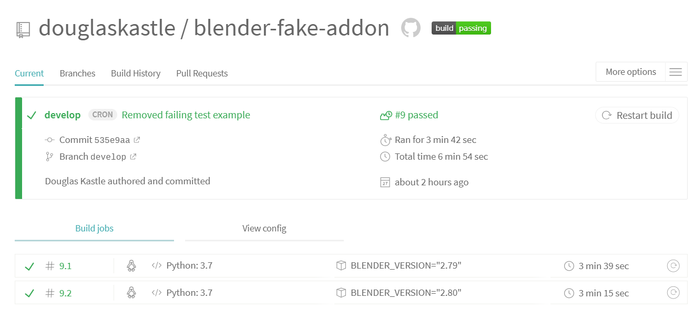
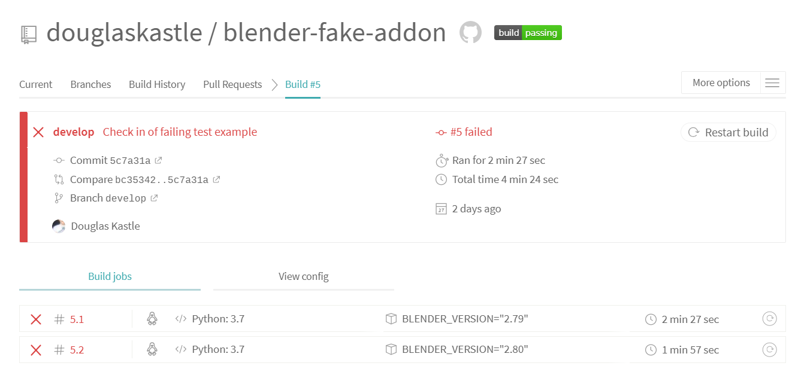
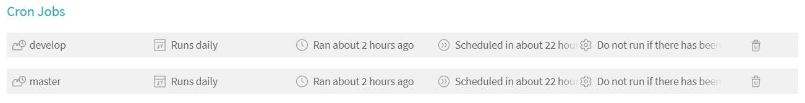

[](https://travis-ci.org/douglaskastle/blender-fake-addon)
[](https://codecov.io/github/douglaskastle/blender-fake-addon?branch=master)

# Blender - pytest - TravisCI integration

The code to shows how the `pytest` can be used inside blender to test an addon.  Once a checkin has been performed TravisCI runs the tests on the current nightly builds for blender 2.79 and 2.8.

## Motivation

I have been around python for the better part of 10 years now.  Python is only just coming of that painful period of time when it transitioned from python2 to python3.  We got there, yay!

I have been playing around with blender for 3-4 years and the move to blender 2.80 from 2.79 is beginning to look very similar.

One obvious area of concern is that the addon used in blender are hardly ever written with any tests.  If some thing was written for 2.56 it may or may not work for 2.65. It usually did so that has allowed some great work to live on.  Hoever the move to 2.80 is really beginning to flag where we suffer for lack of regressable tests.

My new years resolution (2019) was to at least see if I could put together a decent test frame work that could allow for regressable tests, on multiple builts of blender, and have it feed into a continous integration tool, in this case TravisCI that can run against the nightly builds.  

I have also picked `pytest` as I have experience with this from my day job as and microchip validation engineer.  And it is non standard enough the work here shows how you can get any python module you want into blender.

Where possible I try and script in python only.  Some work, usually the wrapper script can be written in bash/sh.  That can wreck my head so here I did it in python for greater code continuity.

## pytest

Blender comes with it own version of python.  When you run blender the python it uses is this one not one that has been installed on you system.  The python that blender somes with has `unittest` as a standard module.  `unittest` is a bit long in the tooth, `pytest` has started to become a lot more popular in the industry. So two things are missing that we need to get, `pip` and `pytest`.  

To install `pip` you need to fetch `get-pip.py` from this path:

`wget https://bootstrap.pypa.io/get-pip.py`

and then we explictly call the python inside blender to install `pip`:

`blender/2.79/python/bin/python3.7m get-pip.py`

this will install `pip` locally that when called will install modules into the blender version of python and not the system.

**linux**: `blender/2.79/python/bin/pip`

**windows**: `blender\2.79\python\Scripts\pip`

we use this `pip` to install pytest:

`blender/2.79/python/bin/pip install pytest`

You will now be able to import pytest inside python scripts called by blender.

## fake-addon

The addon included here is the most basic addon possible.  All it does is print out a message when it is installed and another one when it is removed.  However all addons have required to have version tuple.  This version can be read back through blender.  This is the test we use:

```
    expect_version = (0, 0, 1)
    return_version = get_version(bpy_module)
    assert  expect_version == return_version
```

In the current release, there are two tests, one to check that the right value gets returned for the version ID and one to check if the wrong value returned is detected correctly.  These pass.  If you wish to see a correct failure under pytest, changed the `expect_version` value to something it should now be.

During the `pytest` `configure` phase the helper scripts have been written to handle the zipping of the addon into a zip file, which is then imported into blender.  If this import was unsuccessfuly the `get_version()` would error, which would be captured by `pytest`.

The `unconfigure` removes the `addon` from the `scripts/addon` directory used by blender . 

## Run tests locally

To run the test locally you need to have a version of blender present. Since these scripts were written to work on multiple revisions of blender at the same time, your standard unzips should got here accordingly:

**2.79** : `blender_build/blender_2.79`

**2.80** : `blender_build/blender_2.80`

To run the tests locally we use the system python to run the script, one could arguably use the one included in blender itself.

`python tests/run_blender.py 2.79`

```
============================= test session starts =============================
platform win32 -- Python 3.6.2, pytest-4.1.0, py-1.7.0, pluggy-0.8.0
rootdir: D:\blender-fake-addon, inifile:
collected 2 items

tests\test_pytest.py ..                                                  [100%]

========================== 2 passed in 0.20 seconds ===========================
```


## TravisCI

To use TravisCI you need to link your github account.

The script has two modes, 2.79 and 2.80.  The script, `get_blender_name.py`, is used to webscrape the blender downloads site and fetch the current revision numbers of the nightly builds.

When downloading we use a cache for the tar.bz2 file we get.  This allows us to do faster incremental testing.  Keep an eye on your cache sizes over on TravisCI that they don't blow up.

Here is an example of a successful run:



And this was the result of a test that was checked in a a failure forced:



And here is what can be found in the log for the error.

```
_____________________________ test_versionID_pass ______________________________
bpy_module = 'fake_addon'
    def test_versionID_pass(bpy_module):
        expect_version = (1, 0, 1)
        return_version = get_version(bpy_module)
>       assert  expect_version == return_version
E       assert (1, 0, 1) == (0, 0, 1)
E         At index 0 diff: 1 != 0
E         Use -v to get the full diff
tests/test_pytest.py:11: AssertionError
====================== 1 failed, 1 passed in 0.08 seconds ======================
Cleaning up - fake_addon
Goodbye World
*** test run reporting finished
Error: Not freed memory blocks: 1, total unfreed memory 0.000214 MB
The command "python tests/run_blender.py ${BLENDER_VERSION}" exited with 1.
```
As we want to run against the nightly builds we need to set up some cronjobs to run.  These can be found under settings.  I added a daily cron for my builds as I imagine my addon isn't changing that much, it is a potential change in the how the nightly builds work is what we really want to catch early.



Please consult the `.travis.yml` file for the remainder of operation it is quite self explanitory.

## Coverage

TBD

## Wrapup

This is just one attempt at building a verification flow.  If you have any comments for improvements please get in touch.
